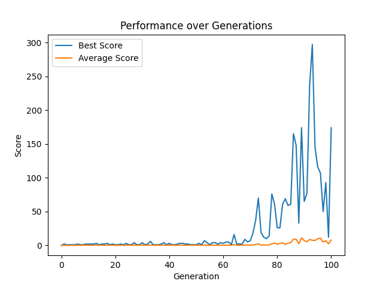

# Genetic Flappy Bird: An Evolutionary Approach

## Introduction

Welcome to the Genetic Flappy Bird project. This is not just a game; it's an experiment in artificial life and evolution, where the renowned Flappy Bird game meets Genetic Algorithms. In this exciting innovation, birds are programmed to play the game, learn, evolve, and get better through generations.

## Project Goal

The primary objective of this project is to create an intelligent agent capable of playing the Flappy Bird game autonomously and proficiently. We simulate a population of birds navigating through the game, and through the principles of natural selection, genetic crossover, and mutation, we let the birds evolve to find a strategy that excels at the game.

## Challenges Faced

### 1. **Diversity and Exploration**

   - **Problem:** Initial generations lacked diversity, leading to premature convergence and a lack of exploration in the solution space.
   - **Solution:** Enhanced mutation strategies were employed to introduce variety and improve exploration.

### 2. **Selection Strategy**

   - **Problem:** Various selection mechanisms were tried, like tournament and roulette wheel, each with its own challenges in choosing parents for crossover.
   - **Solution:** Adopted a fitness-proportional selection strategy, ensuring a balance between exploration and exploitation.

### 3. **Hyperparameter Optimization**

   - **Problem:** Finding an optimal set of hyperparameters to guide the genetic algorithm was a significant challenge.
   - **Solution:** A thorough grid search and multiple iterations helped fine-tune the hyperparameters for better performance.

## Methodologies and Strategies

### **Mutation**

Different mutation approaches were experimented with to maintain diversity within the population, ensuring a wide exploration of the solution space.

### **Crossover**

Various crossover methods such as uniform, one-point, and two-point crossovers were implemented to combine the genetic information of selected parents effectively.

### **Selection**

Roulette wheel selection, proportional to a bird's fitness, was chosen as the most effective strategy to select birds for breeding the next generation.

### **Fitness Evaluation**

A robust fitness function was developed, incorporating rewards and penalties to guide the evolution process towards more proficient navigation strategies.

### **Elite Preservation**

Elite preservation strategies were employed to ensure that the best individuals are carried over to subsequent generations, preserving their genetic information.

## Hyperparameter Tuning

Extensive experiments were conducted to tune the hyperparameters, using grid search to explore various combinations of population sizes, mutation rates, and hidden layer sizes.

### Optimal Hyperparameters:
- **Population Size:** 200
- **Mutation Rate:** 0.1
- **Hidden Layer Sizes:** 11
- **Crossover Method:** Uniform

## Visualization and Results

A comprehensive score plot visualizes the evolution process, portraying the progress in the best and average scores over generations.

## Conclusion and Future Directions

This project illustrates the versatility of Genetic Algorithms in solving optimization problems, even in the complex and dynamic landscape of a game like Flappy Bird. The journey through various evolutionary strategies has been enriching, leading to a proficient and autonomous agent capable of navigating the game with remarkable competence.

The future may see further enhancements, exploring different evolutionary strategies, and diving deeper into the realms of artificial life and computational intelligence.

